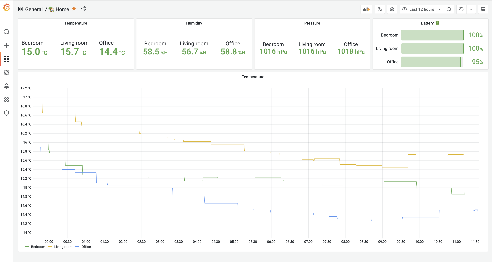
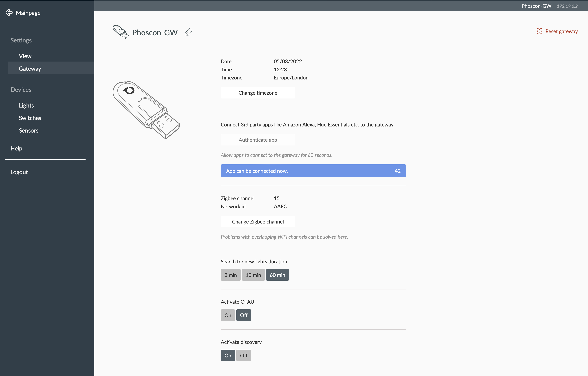

# 🚀 deconz-exporter

A very simple (and naive) Prometheus exporter for [deCONZ Phoscon][phoscon] zigbee gateway.
Exports prometheus metrics for sensors connected to [Conbee II][conbee2] USB gateway.



## 📈 Exported metrics

```
# HELP deconz_gateway_info Gateway static info
# TYPE deconz_gateway_info gauge
deconz_gateway_info{apiversion, name}

# HELP deconz_battery Battery level of sensors
# TYPE deconz_battery gauge
deconz_battery{manufacturername, modelid, name, swversion}

# HELP deconz_humidity Relative humidity in percentage
# TYPE deconz_humidity gauge
deconz_humidity_ratio{manufacturername, modelid, name, swversion, type}

# HELP deconz_pressure Pressure in hPa
# TYPE deconz_pressure gauge
deconz_pressure_hpa{manufacturername,modelid, name, swversion, type}

# HELP deconz_temperature Temperature in degree Celsius
# TYPE deconz_temperature gauge
deconz_temperature_celsius{manufacturername, modelid, name, swversion, type}
```

## 🚲 Getting started

1. Enable discovery in gateway settings

   

2. Generate a new username for the exporter

   ```bash
   $ curl -X POST -s http://<rest api endpoint>/api -d '{"devicetype": "deconz-exporter"}' | jq

   [{"success":{"username":"0E87CDA111"}}]
   ```

3. Start the exporter.

   ```bash
   $ cargo run -- --url http://<gateway rest API>:4501 --username 0E87CDA111 --port 9199
   ```

4. Profit! 🥇

## ⚙️ How does this work?

1. The exporter must be configured with a valid username and url to connect to [deCONZ REST API].
1. The websocket port is discovered though the REST API.
1. The [Websocket API] provides streaming updates to the exporter, which gets converted to metrics.

## 🕵️‍♂️ Debugging tips

1. [websocat] is a handy tool to see the raw websocket events emitted. Use it to debug issues, capture some sample
   events etc.

   ```
   $ websocat ws://nyx.jabid.in:4502

   {"attr":{"id":"1","lastannounced":null,"lastseen":"2022-03-04T22:42Z","manufacturername":"dresden elektronik","modelid":...
   ```

2. Run `$ cargo test` just to be sure.

## 📝 Notes

1. This exporter is only tested with a few devices I own. There is no guarantee that it would work with anything else.
1. Feel free to send me PRs for [other devices supported][compatibility] by [Conbee II][conbee2]
1. The auth flow is cumbersome and manual, would be great to automate this.
1. Reconnect cleanly on websocket errors, right now the exporter just dies and gets restarted
1. Process metrics are missing, should bring them back.
1. Auto discovery of gateways might be nice.
1. Add metrics on the number of events handled

## ⚖️ License

[MIT](https://choosealicense.com/licenses/mit)

[compatibility]: https://phoscon.de/en/conbee2/compatible
[conbee2]: https://phoscon.de/en/conbee2
[deconz rest api]: https://dresden-elektronik.github.io/deconz-rest-doc
[phoscon]: https://phoscon.de/en/conbee2/software#phoscon-app
[websocat]: https://github.com/vi/websocat
[websocket api]: https://dresden-elektronik.github.io/deconz-rest-doc/endpoints/websocket
